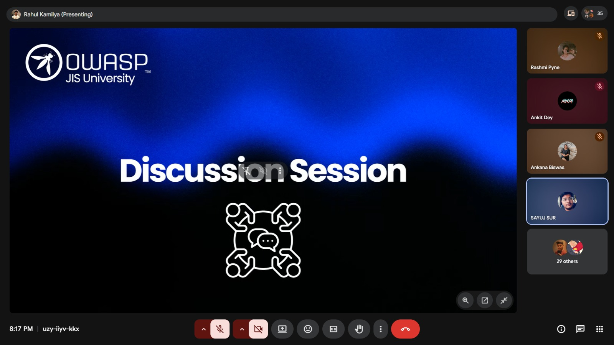
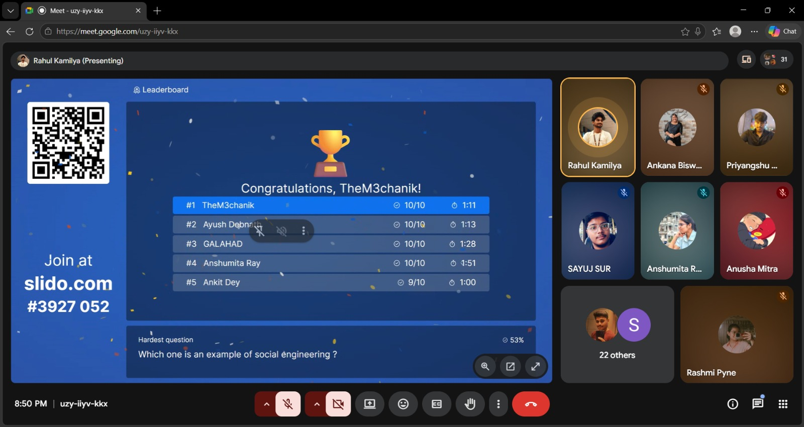
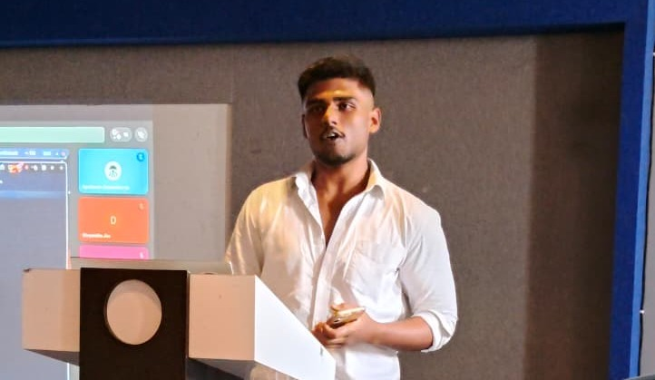
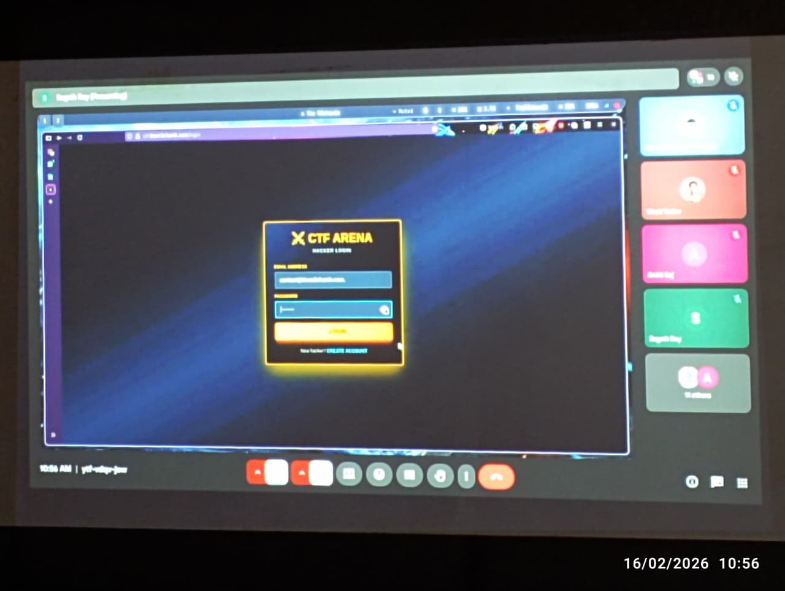
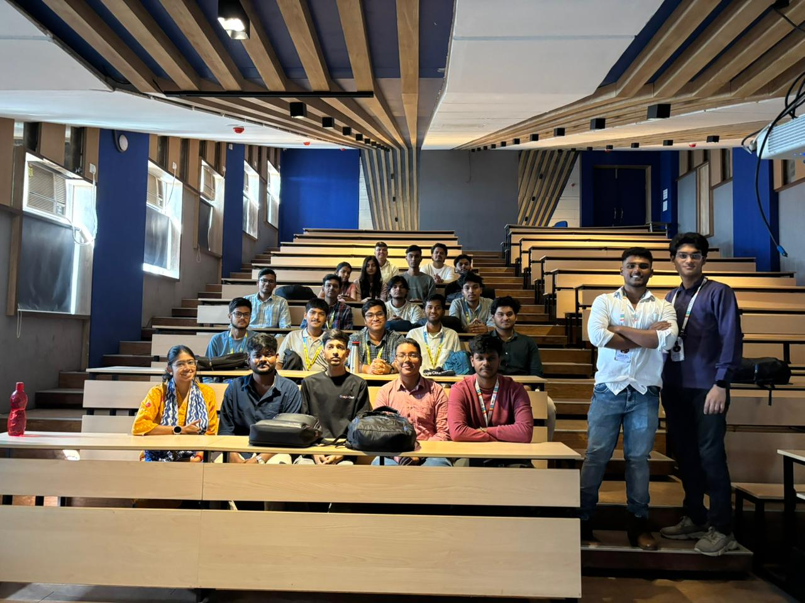
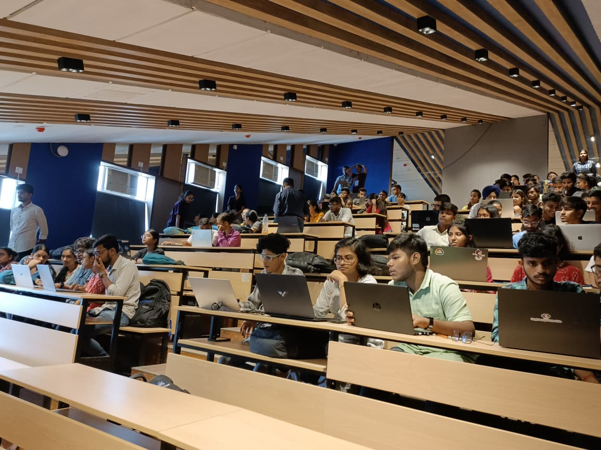
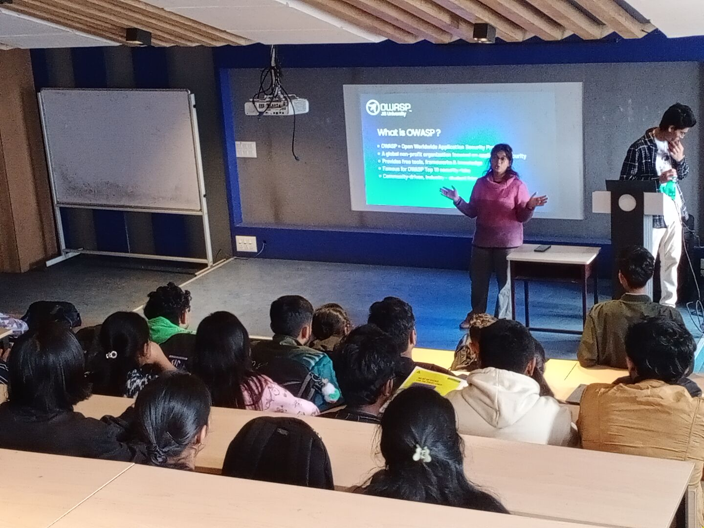
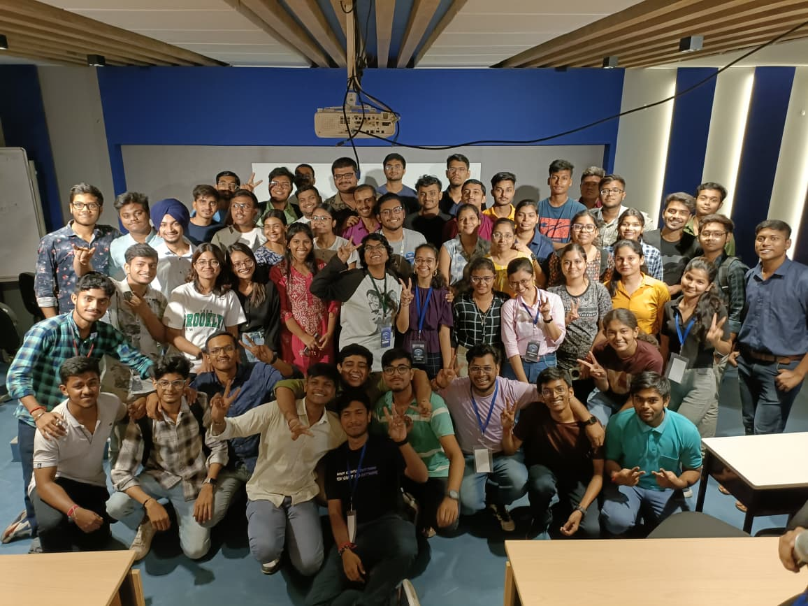

<h1 style="margin-bottom:10px;">Events</h1>

Welcome to the Events section of <strong>OWASP JIS University Student Chapter</strong>. 
Here you’ll find details about our upcoming engagements and successfully conducted cybersecurity events.

<h2 style="margin-top:25px;">Upcoming Events 🗓️</h2>

No upcoming events are currently announced. Please check back later.

<h2 style="margin-top:25px;">Past Events ⏳</h2>

30 Apr 2026 - April Virtual Discussion Meetup

 

<h3>Event Overview 🚩</h3>

<strong>Event Name:</strong> April Virtual Meetup 
<strong>Location:</strong> Virtual (Google Meet) 
<strong>Duration:</strong> 2 Hours 
<strong>Status:</strong> ✅ Successfully Completed

During the April Virtual Meetup, we discussed OWASP initiatives, connected with participants through networking and open discussions, shared plans for upcoming sessions, hosted a small quiz, and distributed small swags to attendees.

<h3 style="margin-top:20px;">🌟 Event Highlights</h3>

  
  

30 Mar 2026 - OWASP 101 Event - OWASP JISU Meetup

 

<h3>Event Overview 🚩</h3>

<strong>Event Name:</strong> OWASP JISU 101 Meetup 
<strong>Location:</strong> JIS University 
<strong>Duration:</strong> 5 Hours 
<strong>Status:</strong> ✅ Successfully Completed

In this event, we introduced the OWASP core team, hosted a speaker session, and conducted an interactive quiz session.

<em>Photos will be updated soon.</em>

16 Feb 2026 - Auditing Codebases as a Pentester & CTF Competitions

 

<h3>Event Overview 🚩</h3>

<strong>Event Name:</strong> Audit Codebases as a Pentester & CTF's 
<strong>Location:</strong> JIS University, Room No. 1009 
<strong>Duration:</strong> 4 Hours 
<strong>Status:</strong> ✅ Successfully Completed

This intensive 4-hour workshop focused on teaching participants how to audit codebases from a penetration tester's perspective. The session included live demonstrations and hands-on CTF challenges to reinforce secure code review techniques and vulnerability identification.

<h3 style="margin-top:20px;">🎤 Speaker</h3>

<table style="width:100%; border-collapse:collapse; font-family:Arial, sans-serif; margin-top:15px;">

  <thead>
    <tr style="background-color:#404660; color:white; text-align:left;">
      <th style="padding:12px; border:1px solid #e0e0e0;">Speaker Name</th>
      <th style="padding:12px; border:1px solid #e0e0e0;">Designation</th>
      <th style="padding:12px; border:1px solid #e0e0e0;">Session Topic</th>
    </tr>
  </thead>

  <tbody>

    <tr style="background-color:#f9f9f9;">
      <td style="padding:12px; border:1px solid #e0e0e0;" data-label="Speaker Name"><strong>Sagnik Roy</strong></td>
      <td style="padding:12px; border:1px solid #e0e0e0;" data-label="Designation">Cyber Security Mentor (GDG JISU)</td>
      <td style="padding:12px; border:1px solid #e0e0e0;" data-label="Session Topic">How I Audit Codebases as a Pentester (Live CTF Walkthrough)</td>
    </tr>

  </tbody>

</table>

<h3 style="margin-top:20px;">🌟 Event Highlights</h3>

  
  
  

28 Jan 2026 - OWASP Speaker & CTF Series X CodeSprint Hackathon

 

<h3>Event Overview 🚩</h3>

<strong>Event Name:</strong> OWASP JISU x CodeSprint Hackathon 
<strong>Location:</strong> JIS University 
<strong>Duration:</strong> 24 Hours 
<strong>Status:</strong> ✅ Successfully Completed

OWASP JISU x CodeSprint Hackathon was a 24-hour hackathon conducted at JIS University, Kolkata, bringing together developers, security enthusiasts, and innovators to solve real-world challenges while promoting secure coding practices.

As part of this event, we organized an <strong>OWASP Speaker Session</strong> to share insights on application security and best practices, followed by <strong>CTF Competitions</strong> to test participants' cybersecurity skills in real-world scenarios.

<h3 style="margin-top:20px;">🎤 Speaker</h3>

<table style="width:100%; border-collapse:collapse; font-family:Arial, sans-serif; margin-top:15px;">

  <thead>
    <tr style="background-color:#404660; color:white; text-align:left;">
      <th style="padding:12px; border:1px solid #e0e0e0;">Speaker Name</th>
      <th style="padding:12px; border:1px solid #e0e0e0;">Designation</th>
      <th style="padding:12px; border:1px solid #e0e0e0;">Session Topic</th>
    </tr>
  </thead>

  <tbody>

    <tr style="background-color:#f9f9f9;">
      <td style="padding:12px; border:1px solid #e0e0e0;" data-label="Speaker Name"><strong>Shreya Dutta</strong></td>
      <td style="padding:12px; border:1px solid #e0e0e0;" data-label="Designation">Cybersecurity Mentor & OWASP Chapter Lead</td>
      <td style="padding:12px; border:1px solid #e0e0e0;" data-label="Session Topic">Server-Side Template Injection (SSTI) & Code Injection Mitigation Strategies</td>
    </tr>

  </tbody>

</table>

<h3 style="margin-top:20px;">🌟 Event Highlights</h3>

  
  
  

28 to 29 June 2025 - HexaFalls – National Level Hackathon & CTF Series

 

<h3>Event Overview 🚩</h3>

<strong>Event Name:</strong> HexaFalls Hackathon 
<strong>Location:</strong> JIS University 
<strong>Duration:</strong> 32 Hours 
<strong>Status:</strong> ✅ Successfully Completed

HexaFalls was a flagship 32-hour national-level hackathon conducted at JIS University,
bringing together innovators, developers, and cybersecurity enthusiasts to build impactful technical solutions.

As part of this mega event, we hosted the <strong>HexaFalls CTF Series (Capture The Flag)</strong>
to challenge participants in real-world cybersecurity scenarios.

<h3 style="margin-top:20px;">🏁 CTF Rounds Conducted</h3>

<table style="width:100%; border-collapse:collapse; font-family:Arial, sans-serif; margin-top:15px;">

  <thead>
    <tr style="background-color:#4a4a4a; color:white; text-align:left;">
      <th style="padding:10px; border:1px solid #ddd;">Title</th>
      <th style="padding:10px; border:1px solid #ddd;">Agenda</th>
      <th style="padding:10px; border:1px solid #ddd;">Location</th>
      <th style="padding:10px; border:1px solid #ddd;">Date</th>
      <th style="padding:10px; border:1px solid #ddd;">Time</th>
      <th style="padding:10px; border:1px solid #ddd;">Status</th>
    </tr>
  </thead>

  <tbody>

    <tr style="background-color:#f2f6fc;">
      <td style="padding:10px; border:1px solid #ddd;" data-label="Title"><strong>HexaFalls CTF</strong></td>
      <td style="padding:10px; border:1px solid #ddd;" data-label="Agenda">CTF - Round 1</td>
      <td style="padding:10px; border:1px solid #ddd;" data-label="Location">JIS University</td>
      <td style="padding:10px; border:1px solid #ddd;" data-label="Date">28 June 2025</td>
      <td style="padding:10px; border:1px solid #ddd;" data-label="Time">19:30</td>
      <td style="padding:10px; border:1px solid #ddd; color:green;" data-label="Status"><strong>✅ Completed</strong></td>
    </tr>

    <tr>
      <td style="padding:10px; border:1px solid #ddd;" data-label="Title"><strong>HexaFalls CTF</strong></td>
      <td style="padding:10px; border:1px solid #ddd;" data-label="Agenda">CTF - Round 2</td>
      <td style="padding:10px; border:1px solid #ddd;" data-label="Location">JIS University</td>
      <td style="padding:10px; border:1px solid #ddd;" data-label="Date">28 June 2025</td>
      <td style="padding:10px; border:1px solid #ddd;" data-label="Time">02:00</td>
      <td style="padding:10px; border:1px solid #ddd; color:green;" data-label="Status"><strong>✅ Completed</strong></td>
    </tr>

    <tr style="background-color:#f2f6fc;">
      <td style="padding:10px; border:1px solid #ddd;" data-label="Title"><strong>HexaFalls CTF</strong></td>
      <td style="padding:10px; border:1px solid #ddd;" data-label="Agenda">CTF - Round 3</td>
      <td style="padding:10px; border:1px solid #ddd;" data-label="Location">JIS University</td>
      <td style="padding:10px; border:1px solid #ddd;" data-label="Date">29 June 2025</td>
      <td style="padding:10px; border:1px solid #ddd;" data-label="Time">08:30</td>
      <td style="padding:10px; border:1px solid #ddd; color:green;" data-label="Status"><strong>✅ Completed</strong></td>
    </tr>

  </tbody>

</table>

<h3 style="margin-top:20px;">🌟 Event Highlights</h3>

  
  
  

  
  
  

